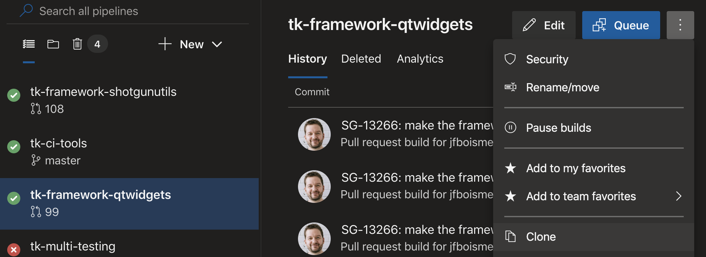
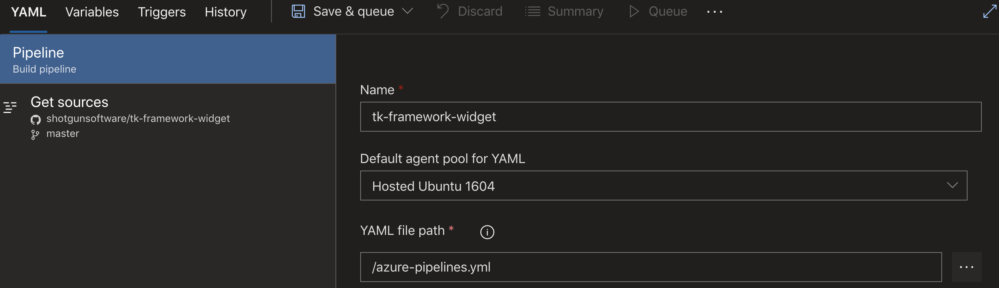
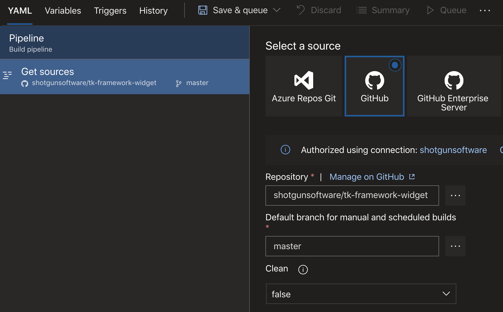
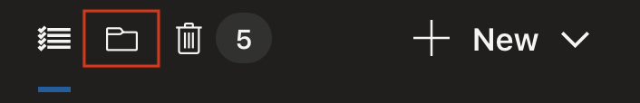
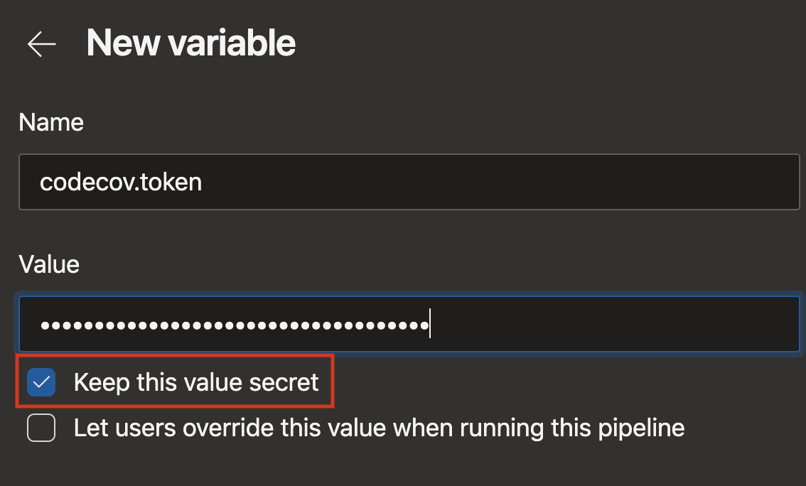
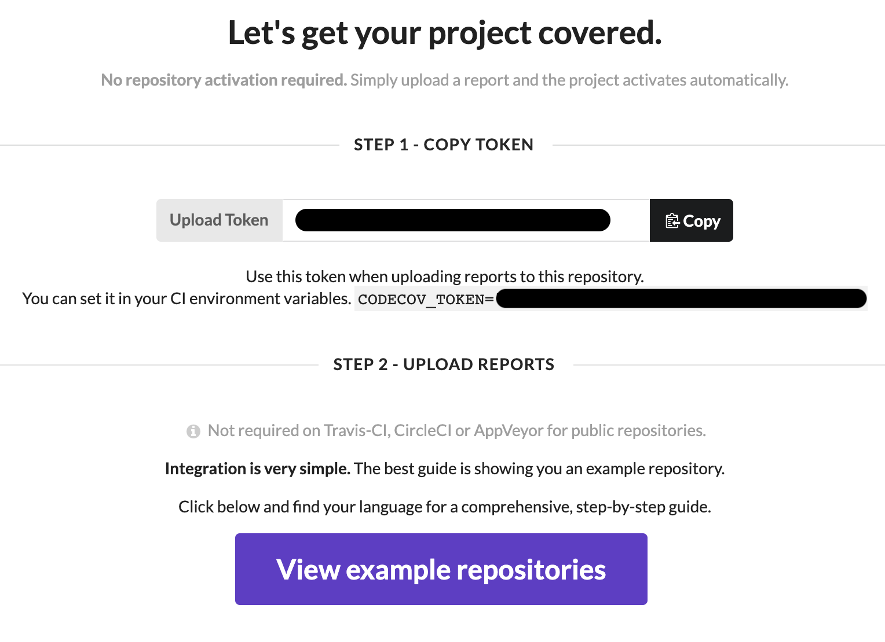

# tk-ci-tools

Tools for Azure Pipelines. These tools allow a Toolkit developer to validate their code using Azure Pipelines, ensuring the code is formatted properly, does not contain ambiguous statements and passes all the tests.

The pipeline is split into two main sections
- code style validation
- running tests

Code style validation is enforced by running the `pre-commit` hook on all the files in the repository. Tests are run on Windows, macOS and Linux and with both Python 2.7 and 3.7 using `pytest` and [`tk-toolchain`](https://github.com/shotgunsoftware/tk-toolchain)

> Due to a technical limitation, Linux can't run Python 2.7 tests at the moment.

# Requirements to the build pipeline

## pre-commit hook

Your respository needs to have a pre-commit hook for the code style validation to pass. All Toolkit repositories are expected to have them.

You save the following as a starting point at the root of your respository in a file called `.pre-commit-config.yaml`. The `exclude` setting is a regular expression matching file paths that should not be validated.

```yaml
# Copyright (c) 2019 Shotgun Software Inc.
#
# CONFIDENTIAL AND PROPRIETARY
#
# This work is provided "AS IS" and subject to the Shotgun Pipeline Toolkit
# Source Code License included in this distribution package. See LICENSE.
# By accessing, using, copying or modifying this work you indicate your
# agreement to the Shotgun Pipeline Toolkit Source Code License. All rights
# not expressly granted therein are reserved by Shotgun Software Inc.

# Styles the code properly
# Exclude the UI files, as they are auto-generated.
exclude: "ui\/.*py$"
# List of super useful formatters.
repos:
  - repo: https://github.com/pre-commit/pre-commit-hooks
    rev: v2.2.3
    hooks:
    # Ensures the code is syntaxically correct
    - id: check-ast
      language_version: python3
    # Ensures a file name will resolve on all platform
    - id: check-case-conflict
    # Checks files with the execute bit set have shebangs
    - id: check-executables-have-shebangs
    # Ensure there's no incomplete merges
    - id: check-merge-conflict
    # Adds an empty line if missing at the end of a file.
    - id: end-of-file-fixer
    # Makes sure requirements.txt is properly formatted
    - id: requirements-txt-fixer
    # Removes trailing whitespaces.
    - id: trailing-whitespace
  # Leave black at the bottom so all touchups are done before it is run.
  - repo: https://github.com/ambv/black
    rev: stable
    hooks:
    - id: black
      language_version: python3
```

## Azure Pipeline configuration

### Invoking the build pipeline from your respository

Create a file named `azure-pipelines.yml` file at the root of your repo and put the following in it:

```yaml
# Imports the shared Azure CI tools from the master branch of shotgunsoftware/tk-ci-tools
resources:
  repositories:
    - repository: templates
      type: github
      name: shotgunsoftware/tk-ci-tools
      ref: refs/heads/master
      endpoint: shotgunsoftware

# We want builds to trigger for 3 reasons:
# - The master branch sees new commits
# - Each PR should get rebuilt when commits are added to it.
# - When we tag something
trigger:
  branches:
    include:
    - master
  tags:
    include:
    - v*
pr:
  branches:
    include:
    - "*"

# This pulls in a variable group from Azure. Variables can be encrypted or not.
variables:
- group: deploy-secrets

# Launch into the build pipeline.
jobs:
- template: build-pipeline.yml@templates
```

If you need to use an in-development version of these tools from a branch, you can update the `ref` in `repositories` section to point to a different branch.

The `build-pipeline.yml` template has a few parameters. You can find out more about them in [build-pipeline.yml](https://github.com/shotgunsoftware/tk-ci-tools/blob/master/build-pipeline.yml).

### Create a build in Azure Pipelines

Once you've added your `azure-pipelines.yml` file to your repository, it's time to add the repository to the Azure Pipelines web service.

1. Go to the [Shotgun Ecosystem Azure Pipelines](https://dev.azure.com/shotgun-ecosystem/Toolkit/_build) page.
2. Select any pipeline from the list, click on the triple dot button at the top right and select clone.
   
3. In the YAML tab, update the build info
4. The name can be updated from the right-hand side of the page. You must name the build after the name of the repository.
   
5. Click on `Get Sources` on the left-hand side and change the repository the code should be clone from.
    
6. Save the pipeline. Do not `Save and Queue`, as the master branch does not have an `azure-pipelines.yml` file yet. Make sure to pick the right folder for your build so that it shows at the right place in the build tree.
7. The build is now created. Since it hasn't run yet, it does not show up in the recent builds tab. Switch the folder view by clicking on the folder icon above the build list.
   
8. Find your build in the treeview and then click on the `Edit` button and then the `Variables` button on the right-hand side.
9. In the Variables tab, create a new variable name `codecov.token` and make sure `Keep this value secret` is checked. This is important or people outside the organization could push coverage data.
   
10. The codecov token for your repository can be found at codecov.io. In this example, we're setting up `tk-framework-widget`, so we can find the key at https://codecov.io/gh/shotgunsoftware/tk-framework-widget.
   
11. Click the copy button and paste it in the `Value` box over at Azure Pipelines. If you've done this right, the value should be masked in the edit box.
12. Hit `Ok`, then `Save` at the bottom right.
13. You're done! You can now push to Azure Pipelines and your changes will be picked up by the build pipeline.
